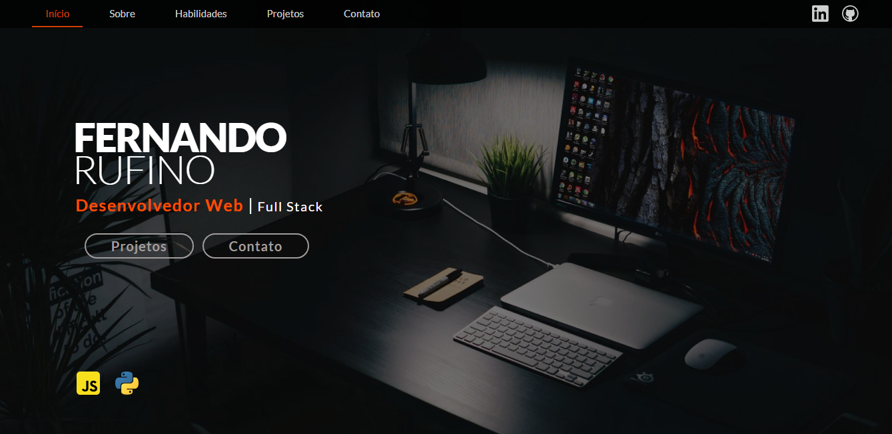

 🚧 Em construção 🚧 

<h1 align="center"> Portfólio - Fernando Rufino </h1>

Esse é o meu portfólio pessoal, onde falo um pouco sobre mim e apresento alguns dos meus projetos.

  <a href="#-tecnologias">Tecnologias</a>&nbsp;&nbsp;&nbsp;|&nbsp;&nbsp;&nbsp;
  <a href="#-projeto">Projeto</a>&nbsp;&nbsp;&nbsp;|&nbsp;&nbsp;&nbsp;
  <a href="#-layout">Layout</a>&nbsp;&nbsp;&nbsp;|&nbsp;&nbsp;&nbsp;
  <a href="#memo-licença">Licença</a>

  

 

  

## 🚀 Tecnologias

Esse projeto foi desenvolvido com as seguintes tecnologias:

- HTML e CSS
- JavaScript 
- Git e Github

## 💻 Projeto

Desenvolvido meu primeiro portfólio, onde exercitei e treinei alguns conceitos aprendidos com as tecnologias utilizadas. 

- [x] é possivel acessar minhas redes através dos links;
- [x] é possível visualizar meus projetos (realizado deploy) e o código no GitHub;
- [x] o formulário de e-mail está funcional;
- [x] implementado seleção de dark e light mode para visualização da página.
 

- Acesse o projeto finalizado, [clicando aqui](https://fernandoalvesrufino.github.io/meu-portfolio/).

## 🔖 Layout

Você pode visualizar o layout do projeto através [DESSE LINK](https://www.figma.com/file/LOmPDxQYg0uubbhVuhCP0v/Portf%C3%B3lio---FR---README?t=J5d0KF5hSEXZlZbK-0). É necessário ter conta no [Figma](https://figma.com) para acessá-lo.

## :memo: Licença

Esse projeto está sob a licença MIT.

---

by Fernando Rufino 
>>>>>>> master
